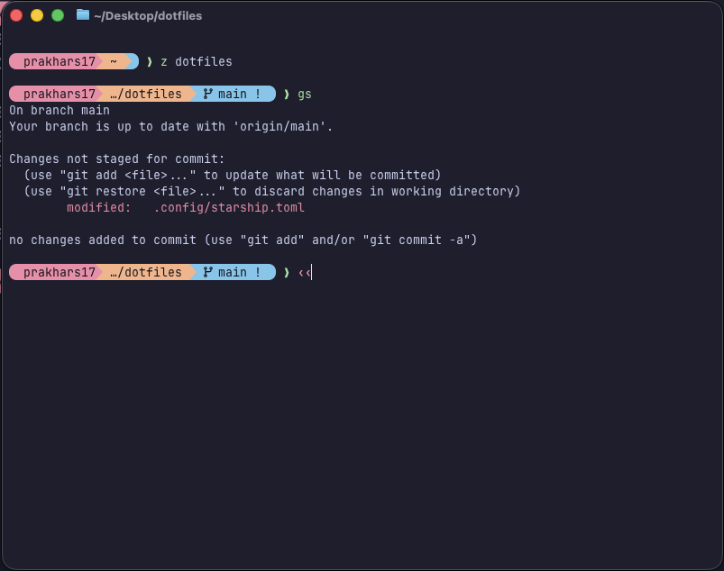

# dotfiles

This repository contains my dotfiles [MacOS].



## Installation

0. Requires zsh to be default.
1. Download [Ghostty](https://ghostty.org/) -
    ```sh
    brew install --cask ghostty
    ```
2. Install required packages -
    ```sh
    brew install starship zsh-autosuggestions zsh-syntax-highlighting zoxide fzf bat eza
    ```
3. Enable keybindings -
    ```sh
    $(brew --prefix)/opt/fzf/install #(keybindings - y, completions - y, auto-shell config - n)
    ```
4. Install JetBrains Nerd Font
    ```sh
    brew install --cask font-jetbrains-mono-nerd-font
    ```
5. Add files to `~` -
    ```sh
    cp .gitconfig ~/
    cp -r .config ~/
    cp .zshrc ~/
    ```