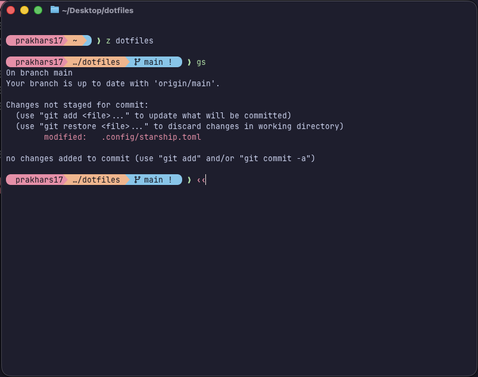

# dotfiles

This repository contains my dotfiles [MacOS].



## Installation

**Automated:** Run the install script:
```sh
./install.sh
```

**Or Manual Steps:**

0. Requires zsh to be default.
1. Check Homebrew is installed -
    ```sh
    command -v brew
    ```
2. Download [Ghostty](https://ghostty.org/) -
    ```sh
    brew install --cask ghostty
    ```
3. Install required packages -
    ```sh
    brew install starship zsh-autosuggestions zsh-syntax-highlighting zoxide fzf bat eza
    ```
4. Enable keybindings (auto-answer) -
    ```sh
    yes | $(brew --prefix)/opt/fzf/install --key-bindings --completion --no-bash
    ```
5. Install JetBrains Nerd Font
    ```sh
    brew install --cask font-jetbrains-mono-nerd-font
    ```
6. Add files to `~` -
    ```sh
    cp .gitconfig ~/
    cp -r .config ~/
    cp .zshrc ~/
    ```
7. Reload shell configuration -
    ```sh
    exec zsh
    ```